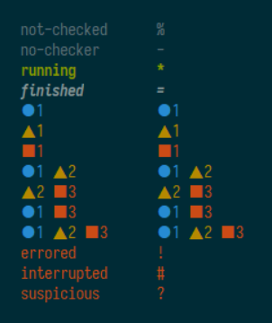

# flycheck-indicator

[](https://melpa.org/#/flycheck-indicator)

An Emacs minor-mode to get a fancy mode line indicator
for [Flycheck](https://github.com/flycheck/flycheck).

# Configuration

## Manual

```
(require 'flycheck-indicator)

(eval-after-load "flycheck"
    '(add-hook 'flycheck-mode-hook 'flycheck-indicator-mode))
```

## With use-package

```
(use-package flycheck-indicator
  :hook (flycheck-mode . flycheck-indicator-mode))
```

# Customization

The icons and faces can be customized in the customization group `flycheck-indicator`:

```
M-x customize-group
flycheck-indicator
```
    
# Examples

Here are some screenshots of the indicator in all the possible statuses with default (left) and customized (right)  status icon
with [Solarized theme](https://ethanschoonover.com/solarized/).


